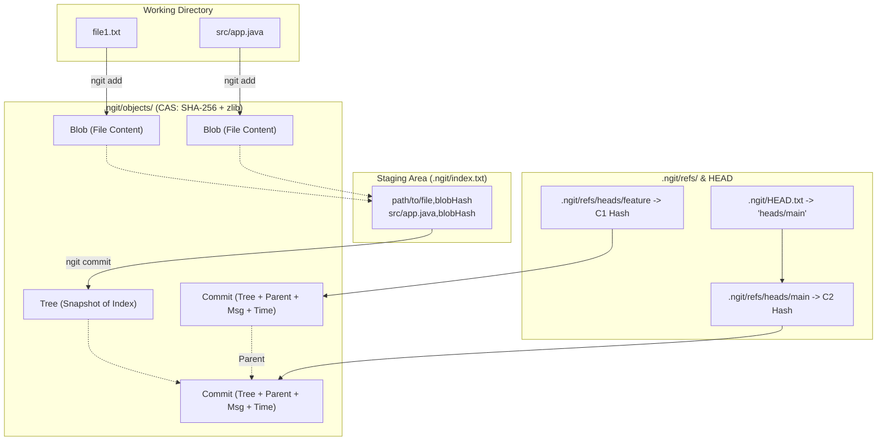

# ngit — A Git Implementation From Scratch in Java

**ngit** is a lightweight, zero-dependency Git-like version control system built from scratch in pure Java. It reimplements Git's core internals — content-addressable storage, SHA-256 object hashing, zlib compression, branching, commits, LCS-based diffing, and three-way merging — using nothing but the Java standard library (`NIO`, `MessageDigest`, `java.util.zip`). Built as a learning project to understand what actually happens under the hood of `git add`, `git commit`, `git branch`, `git diff`, and `git merge`.


```
        ╔══════════════════════════════════════════╗
        ║                 ngit                     ║
        ║       A tiny Git-like VCS in Java        ║
        ╚══════════════════════════════════════════╝
```

**Keywords:** version control system in Java, build your own Git, Git internals explained, content-addressable storage, SHA-256 object store, Git clone from scratch, Java NIO project, custom VCS implementation, LCS diff algorithm, three-way merge algorithm.

---

## Table of Contents

- [Why ngit Exists](#why-ngit-exists)
- [Features](#features)
- [How It Works: Git Internals Explained](#how-it-works-git-internals-explained)
- [Storage Layout](#storage-layout-ngit)
- [Core Data Models](#core-data-models)
- [Command Reference](#command-reference)
- [Quick Start](#quick-start)
- [Installation](#installation)
- [Build From Source](#build-from-source)
- [Tech Stack](#tech-stack)
- [FAQ](#faq)
- [Roadmap](#roadmap)
- [About](#about)
- [License](#license)

---

## Why ngit Exists

Most developers use Git daily without ever seeing what happens beneath the command line. `ngit` is a from-scratch reimplementation of Git's core mechanics in **pure Java** — no JGit, no libgit2 bindings, no wrapping the real Git binary. Every object store, hash, compression pass, and merge algorithm is hand-written. If you're searching for **how Git works internally**, **how to build a version control system from scratch**, or a **Java systems-programming project** that goes deeper than CRUD apps, this repo is exactly that.

---

## Features

- **Content-addressable storage (CAS)** — every object (blob, tree, commit) is hashed with SHA-256 and stored compressed via zlib
- **Automatic deduplication** — identical file content is only ever stored once, just like real Git
- **Full staging workflow** — `add`, `status` with on-track / modified / untracked detection
- **Branching model** — lightweight branch refs, `branch`, `checkout`
- **Commit history** — parent-linked commit chain, `log`
- **LCS-based diff engine** — line-level diffing using Longest Common Subsequence
- **Three-way merge** — common-ancestor conflict resolution, `merge`
- **Zero dependencies** — pure JDK standard library, nothing else
- **Cross-platform native installers** — packaged with `jpackage` for Windows, Linux, and macOS

---

## How It Works: Git Internals Explained

`ngit` operates on a **content-addressable storage (CAS)** model where all objects (blobs, trees, commits) are addressed by their SHA-256 hash and compressed using zlib (`Deflater` / `Inflater`) — the same core model real Git uses internally.



---

## Storage Layout (`.ngit/`)

```text
.ngit/
├── HEAD.txt              # Contains relative path to active branch (e.g. "heads/main")
├── index.txt             # Staging area mapping: "<relativePath>,<sha256Hash>"
├── refs/
│   └── heads/
│       ├── main          # Plaintext file containing latest commit SHA-256 hash
│       └── <branchName>  # Plaintext branch pointer to a commit SHA-256 hash
└── objects/
    └── <sha256>          # Compressed binary payload (Blob, Tree, or Commit)
```

---

## Core Data Models

| Object | Description |
| :--- | :--- |
| **Blob** (`ObjectStore`) | Raw file contents hashed with SHA-256, compressed via `Deflater`, stored under `.ngit/objects/<sha256>`. Deduplicated automatically. |
| **Index** (`Index`) | Staging table stored in `.ngit/index.txt`, held in-memory as a `HashMap<Path, String>` mapping relative file paths to blob hashes. |
| **Tree** (`Tree`) | Snapshots the full staging area into `.ngit/objects/<treeHash>`, capturing repository state at commit time. |
| **Commit** (`Commit`) | Immutable metadata object: `Tree:<hash>`, `Parent:<hash>`, `CommitMessage:<text>`, `TimeStamp:dd-MM-yyyy,hh:mm:ss`. Compressed and stored, with its hash written to the active branch ref. |

---

## Command Reference

| Command | Execution Workflow |
| :--- | :--- |
| **`ngit init`** | Creates `.ngit/`, `refs/heads/`, `objects/`, empty `index.txt`, empty `refs/heads/main`, points `HEAD.txt` to `heads/main`. |
| **`ngit add <path>`** | Walks target path (ignoring `.ngit/`), writes compressed blobs into `objects/`, records relative paths and hashes into `index.txt`. |
| **`ngit status`** | Scans working tree excluding `.ngit/`. Categorizes files as **On Track**, **Modified**, or **Untracked**. |
| **`ngit commit -m "msg"`** | Compresses index snapshot into a Tree → reads parent commit from active branch ref → creates and stores Commit object → updates branch ref with new commit hash. |
| **`ngit log`** | Reads active branch hash → decompresses commit object → outputs metadata → follows `Parent:` pointer back to the root commit. |
| **`ngit branch <name>`** | Copies current branch's commit hash to a new ref at `.ngit/refs/heads/<name>`. |
| **`ngit checkout <name>`** | Verifies clean working directory → deletes tracked files → reads target branch → Tree → Index → decompresses and writes blobs to disk → updates `HEAD.txt`. |
| **`ngit diff <file>`** | Computes a line-level diff between the working copy and the staged/committed blob using an LCS-based algorithm. |
| **`ngit merge <branch>`** | Locates common ancestor commit, performs a three-way merge between current branch, target branch, and ancestor state. |

---

## Quick Start

```bash
# Initialize a repository
ngit init

# Stage a file
ngit add file1.txt

# Check what's staged / modified / untracked
ngit status

# Commit
ngit commit -m "Initial commit"

# Create and switch branches
ngit branch feature
ngit checkout feature

# View history
ngit log

# Diff a file against its last committed state
ngit diff file1.txt

# Merge a branch back in
ngit checkout main
ngit merge feature
```

---

## Installation

### Windows

Download the latest `ngit-windows.exe` from [Releases](../../releases), run it. It installs to `C:\Program Files\ngit` and is added to your system `PATH` automatically — open a new terminal and `ngit` is available globally, just like Git.

### Linux (Debian/Ubuntu)

```bash
wget https://github.com/karansingh-in/ngit/releases/latest/download/ngit-linux.deb
sudo dpkg -i ngit-linux.deb
```

### macOS

Download `ngit-macos.dmg` from [Releases](../../releases), open it, drag `ngit` into Applications.
> Unsigned build — on first run, right-click the app → **Open** to bypass Gatekeeper (or `xattr -d com.apple.quarantine /Applications/ngit.app` from Terminal).

---

## Build From Source

Requires **JDK 17+**.

```bash
git clone https://github.com/karansingh-in/ngit.git
cd ngit
javac -d out $(find src -name "*.java")   # or your actual build command
java -cp out ngit.Main --help
```

---

## Tech Stack

- **Language**: Java (JDK 17+)
- **File I/O**: Java NIO (`java.nio.file.*`)
- **Hashing**: SHA-256 (`java.security.MessageDigest`)
- **Compression**: zlib Deflate/Inflate (`java.util.zip.*`)
- **Diffing**: Custom LCS (Longest Common Subsequence) implementation
- **Packaging**: `jpackage` — native installers for Windows (`.exe`), Linux (`.deb`), and macOS (`.dmg`)
- **Dependencies**: none — pure JDK standard library

---

## FAQ

**Is ngit a replacement for Git?**

No. ngit is an educational reimplementation of Git's core internals, not a production VCS. It doesn't support remotes, rebasing, or the full Git protocol.

**What algorithm does ngit use for diffing?**

A custom LCS (Longest Common Subsequence) implementation for line-level diffs, the same foundational algorithm many real diff tools are built on.

**Does ngit depend on JGit, libgit2, or the real Git binary?**

No. ngit has zero external dependencies — every piece of Git's object model (blobs, trees, commits, refs, CAS, compression, hashing) is implemented from scratch using only the Java standard library.

**Why build a Git clone instead of just using Git?**

To understand Git's internals — content-addressable storage, SHA-256 hashing, tree/commit object structures, and merge algorithms — by implementing them, not just reading about them.

---

## About

```
Built by Karan Singh
GitHub: karansingh-in

ngit is a small version control system built from scratch
to understand how Git works under the hood.

I use Git all the time, but I wanted to understand what
actually happens behind commands like add, commit, branch,
diff, and merge.

The goal isn't to recreate Git.
The goal is to understand it.
```

**Version:** 0.1 · **Status:** Actively building

---

## License

MIT — see [LICENSE](LICENSE) for details.