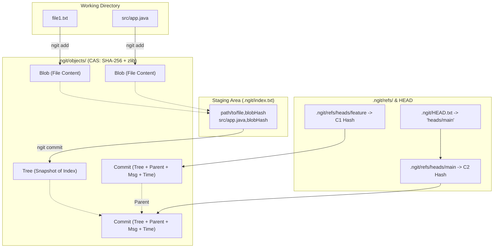

# ngit

A lightweight, zero-dependency Git-like version control system implemented from scratch in pure Java (using standard Java NIO, `MessageDigest`, and `java.util.zip`).

---

## Architecture Overview

`ngit` operates on a **content-addressable storage (CAS)** model where all objects (blobs, trees, commits) are addressed by their SHA-256 hash and compressed using zlib (`Deflater` / `Inflater`).



---

## Storage Layout (`.ngit/`)

The repository metadata lives inside the `.ngit/` directory located at the root of the project:

```text
.ngit/
├── HEAD.txt              # Contains relative path to active branch (e.g. "heads/main")
├── index.txt             # Staging area mapping: "<relativePath>,<sha256Hash>"
├── refs/
│   └── heads/
│       ├── main          # Plaintext file containing latest commit SHA-256 hash
│       └── <branchName>  # Plaintext branch pointer to a commit SHA-256 hash
└── objects/
    └── <sha256>          # Compressed binary payload (Blob, Tree, or Commit)
```

---

## Core Data Models

1. **Blob (`ObjectStore`)**:
   - Raw file contents hashed using SHA-256 and compressed with `Deflater`.
   - Stored under `.ngit/objects/<sha256>`.
   - Deduplicated automatically if file content hash already exists.

2. **Index (`Index`)**:
   - Staging table stored in `.ngit/index.txt`.
   - Maintained in-memory as a `HashMap<Path, String>` mapping relative file paths to their blob SHA-256 hashes.

3. **Tree (`Tree`)**:
   - Snapshots the full staging area (`index.txt`) into `.ngit/objects/<treeHash>`.
   - Stores the state of tracked repository paths at commit time.

4. **Commit (`Commit`)**:
   - An immutable metadata object formatted as:
     ```text
     Tree:<treeSha256>
     Parent:<parentCommitSha256>
     CommitMessage:<messageText>
     TimeStamp:dd-MM-yyyy,hh:mm:ss
     ```
   - Compressed and saved into `objects/`, with its hash written to the active branch ref (`.ngit/refs/heads/<branch>`).

---

## Command Lifecycle & Mechanics

| Command | Execution Workflow |
| :--- | :--- |
| **`ngit init`** | Creates directory structure (`.ngit/`, `refs/heads/`, `objects/`), empty `index.txt`, empty `refs/heads/main`, and points `HEAD.txt` to `heads/main`. |
| **`ngit add <path>`** | Walks target path (ignoring `.ngit/`), writes compressed blobs into `objects/`, and records relative paths and hashes into `index.txt`. |
| **`ngit status`** | Scans working tree excluding `.ngit/`. Categorizes files into **On Track** (staged and unchanged), **Modified** (staged but content changed), or **Untracked** (not in index). |
| **`ngit commit -m "msg"`** | 1. Compresses snapshot of `index.txt` into a Tree object.<br>2. Reads parent commit from active branch ref.<br>3. Creates and stores Commit object in `objects/`.<br>4. Updates active branch file with new commit hash. |
| **`ngit log`** | Reads active branch hash $\rightarrow$ decompresses commit object $\rightarrow$ outputs metadata $\rightarrow$ follows `Parent:` pointer back to the root commit. |
| **`ngit branch <name>`** | Copies current branch commit hash to a new reference at `.ngit/refs/heads/<name>`. |
| **`ngit checkout <name>`** | 1. Verifies working directory is clean via `status()`.<br>2. Deletes currently tracked files.<br>3. Reads target branch commit $\rightarrow$ Tree $\rightarrow$ Index.<br>4. Decompresses each blob and writes files to disk.<br>5. Updates `HEAD.txt` to `heads/<name>`. |

---

## Tech Stack

* **Language**: Java (JDK 17+)
* **File I/O**: Java NIO (`java.nio.file.*`)
* **Hashing**: SHA-256 (`java.security.MessageDigest`)
* **Compression**: zlib Deflate/Inflate (`java.util.zip.*`)
